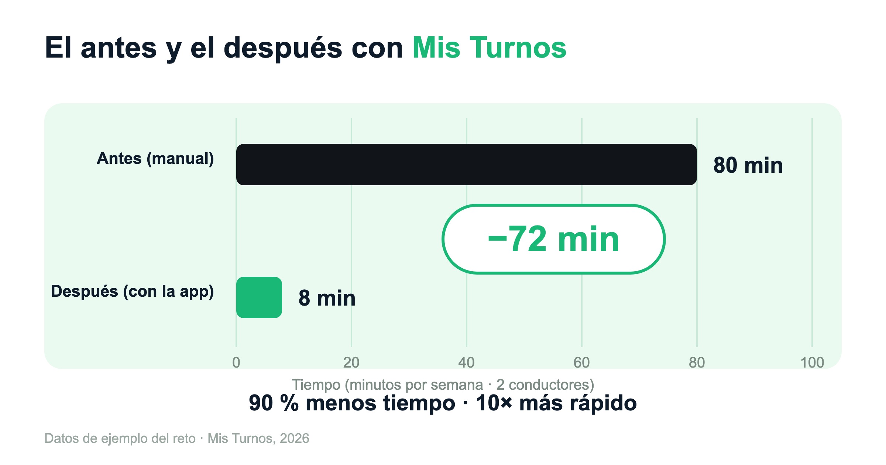

# Mis Turnos — Reto AI Academy (Platzi)

> Una herramienta hecha con IA (Claude Code) que le devuelve más de **una hora cada semana** a una familia
> real, convirtiendo un correo imposible de leer en una hoja lista para imprimir.

**App:** https://mis-rutas.jairyara.dev · **Código:** https://github.com/jairyara/mis-rutas

---

## 1. El problema (real, no inventado)

Mi suegro y mi cuñado son **operadores de bus en Bogotá**. Cada semana reciben por
correo su programación —las "Hojas de trabajo"— como un texto larguísimo lleno de
horas, rutas, códigos de vehículo y paradas. Es **imposible de leer de un vistazo** y,
para poder trabajar, hay que reorganizarlo a mano y pasarlo a una hoja imprimible.

Hoy ese trabajo lo hace la familia, a mano, **todas las semanas**:

- Mi **esposa**, que tiene más práctica con el computador: **15–20 min** por persona.
- Mi **suegra / suegro**, que además le ayudan a mi cuñado: **30–45 min por cada uno**.

Es repetitivo, semanal, y nadie debería tener que hacerlo a mano.

---

## 2. La solución: Entrada → Salida → Fallo

La app hace **una sola cosa, muy bien**: pegas el correo tal cual llega y obtienes la
hoja organizada lista para imprimir. Tres estados claros, como pide el reto:

| Estado | Qué es | Cómo se ve en la app |
|---|---|---|
| **Entrada** | Pegar el correo completo, sin editar nada | Un cuadro de texto: "Pega aquí el correo de la semana" |
| **Salida** | La semana organizada por día + hoja para imprimir/PDF | Tarjetas por día, vehículos resaltados, botón **Imprimir / Guardar PDF** |
| **Fallo** | Detecta cuando lo pegado **no corresponde** o el formato se dañó | Banner rojo: *"Esto no parece la programación de la semana…"* y **se oculta el botón de imprimir** |

El estado de **Fallo** es clave: la persona nunca imprime una hoja incompleta sin
darse cuenta. La herramienta avisa antes de gastar papel.

---

## 3. Resultado: el ahorro semanal (lo que el reto enfatiza)

**Supuestos (transparentes y ajustables):**

- 2 conductores: suegro + cuñado.
- 1 programación por semana, por conductor.
- "Antes" = el tiempo de quien hoy lo hace en la familia (suegra/suegro): 30–45 min.
- "Con la app" = meta del MVP: **5 min como máximo** (en la práctica, ~2–3 min).

### Por conductor

| | Antes (manual) | Con la app | Ahorro |
|---|---|---|---|
| Tiempo | 30–45 min | ≤ 5 min | **~35–40 min (≈ 90 %)** |

### Por semana (los 2 conductores)

| | Antes (manual) | Con la app | Ahorro |
|---|---|---|---|
| Tiempo | **~80 min** (1 h 20) | **~8 min** | **~72 min / semana (≈ 90 %)** |

### Titular para la diapositiva

> **De ~80 minutos a ~8 minutos por semana.**
> **90 % menos tiempo. 10× más rápido.**
> **Más de 60 horas devueltas a la familia cada año** (72 min × 52 semanas ≈ 62 h).



*(Y si lo midiéramos con el tiempo de mi esposa, 15–20 min → ≤5 min, el ahorro sigue
siendo de más del 70 %. El caso más fuerte es el de los usuarios reales: suegro y
suegra.)*

---

## 4. Qué la hace única

**Por qué existe (el origen):**
Mis Turnos no nació de un tablero corporativo, sino de la mesa del comedor. Nació de
ver a mi familia perder horas cada semana descifrando un correo a mano. No es una
demo: es una herramienta que ya usa gente real para trabajar.

**Lo que la diferencia:**

- **Hecha a la medida de SU correo**, no es una app genérica de turnos. Entiende el
  formato exacto de las "Hojas de trabajo" que ellos reciben.
- **Cero curva de aprendizaje.** Pensada para alguien sin habilidades de computación:
  pegar → imprimir. No hay menús, ni configuración, ni cuentas.
- **No imprime errores en silencio.** El estado de Fallo detecta datos que no
  corresponden o un correo cortado y lo avisa.
- **Respeta cómo YA trabajan.** La hoja impresa deja la **columna de Vehículo ancha**
  para que anoten a mano el bus real (como ya lo hacen), y va **compacta para ahorrar
  papel**.
- **Funciona sin internet, se instala como app y es gratis** (PWA).
- **No reemplaza su forma de trabajar: la acelera.**

---

## 5. Cómo reproducirlo (para el jurado)

Hay dos formas. La primera no requiere instalar nada.

### Opción A — App publicada (recomendada)

1. Abre **https://mis-rutas.jairyara.dev**.
2. Pulsa **"Cargar ejemplo"** (debajo del cuadro de texto): carga un correo de **datos
   ficticios** listo para probar.
   - *Alternativa:* usa el enlace **"descargar el .txt"** de al lado, o pega tu propio correo.
3. **Salida:** verás la semana organizada por día. Pulsa **Imprimir / Guardar PDF**.
   - En el diálogo de Chrome, desmarca *"Encabezados y pies de página"* (una sola vez).
4. **Probar el Fallo:** borra todo y pega cualquier texto (ej. "hola"): aparece el
   **banner rojo** y desaparece el botón de imprimir.

### Opción B — Local desde el código

Requisitos: Node 20+.

```bash
git clone https://github.com/jairyara/mis-rutas.git
cd mis-rutas
npm install
npm run dev      # abre la URL que muestre (ej. http://localhost:5173)
# o, para probar la versión instalable (PWA):
npm run build && npm run preview
```

Luego repetir los pasos 2–4 de la Opción A.

### Verificación rápida del parser (opcional)

```bash
node scripts/parse.mjs
```

Imprime en consola la semana de ejemplo ya estructurada (conductor, días, trabajos,
vehículos), demostrando que la lógica de lectura funciona de forma aislada.

---

## 6. El rol de la IA en este proyecto

El reto pide construir una herramienta **usando IA**, y así se hizo — con un criterio
claro: **yo puse el problema, el conocimiento del usuario y las decisiones de producto;
la IA aceleró el diseño y la ingeniería.**

- **Lo aporté yo:** conocer a los usuarios reales (mi suegro y mi cuñado), entender el
  formato del correo, definir qué debía salir en la hoja impresa (columna de vehículo
  ancha para anotar a mano, ahorro de papel) y validar cada iteración contra fotos
  reales de cómo se usa.
- **Lo aceleró la IA (Claude Code):** el análisis de viabilidad, el parser tolerante al
  formato, la hoja de impresión, la detección de errores y el empaquetado como PWA.

El resultado no es una demo automática: es un producto que ya resuelve un problema real,
construido en una fracción del tiempo que habría tomado a mano.
